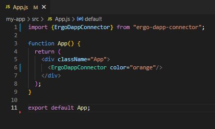
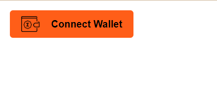

<div id="top"></div>

[![MIT License][license-shield]][license-url]


<!-- PROJECT LOGO -->
<br />
<div align="center">
  <a href="https://github.com/nightowlcasino">
    
  </a>

  <h3 align="center">Ergo dApp Connector React Package</h3>

</div>

<details>
  <summary>Table of Contents</summary>
  <ol>
    <li>
      <a href="#about-the-project">About The Project</a>
      <ul>
        <li><a href="#built-with">Built With</a></li>
      </ul>
    </li>
    <li>
      <a href="#getting-started">Getting Started</a>
      <ul>
        <li><a href="#prerequisites">Prerequisites</a></li>
        <li><a href="#installation">Installation</a></li>
      </ul>
    </li>
    <li><a href="#usage">Usage</a></li>
    <li><a href="#contributing">Contributing</a></li>
    <li><a href="#license">License</a></li>
    <li><a href="#contact">Contact</a></li>
  </ol>

</details>
<br/>

*If you want to go directly to the installation and usage click [here](#installation)*

## About The Project

  Many Open-Source dApps on top of Ergo have already developed their dApp connector. Every dApp has done it similarly but with some minor differences. New developers coming into Ergo will be able to avoid spending days developing and testing something that has already been done, giving them more time to focus on their specific project. 
  This component contains the Ergo dApp Connector and can help new developers by adding the dApp Connector in a few clicks.

  This idea came from an Ergo Community member suggesting creating more documentation regarding Ergo dApp Connection. He was having trouble with the dApp connector, and looking at the open-Source code was not enough. His suggestion made the Night Owl team believe that creating an Ergo dApp Connector during the ErgoHack would potentially be the most helpful tool for future developers coming to build on Ergo. We're hoping our open-source code helps other projects too!

Open-source is the way!


##### 1. What is this package/library?
  Ergo dApp Connector library for React came out of the necessity of various users while developing websites for their dApps. The package contains a component that is an Ergo dApp Connector, which means that by downloading it and calling it in your code, you will have handled the whole dApp Connection! Examples of how to do this will be demonstrated. 

##### 2. Who does it benefit? 

  It benefits new developers coming to build on Ergo who want to avoid dealing with the dApp Connection. Even if the developer didn’t want to use the package itself, he could access this package's public and open-source repository, understand how it is done line by line, and learn the process. 


### Built With

As mentioned it is a React Package, therefore React will be the JS library used for this package. Created using React version ^18.1.0.

* [React.js](https://reactjs.org/)
* [Storybook.js](https://storybook.js.org/)
* [Rollup.js](https://rollupjs.org/guide/en/)
* [Nautilus](https://chrome.google.com/webstore/detail/nautilus-wallet/gjlmehlldlphhljhpnlddaodbjjcchai)

<p align="right">(<a href="#top">Back to top</a>)</p>

## Getting Started

Here we will explain how to properly use the package.

### Prerequisites
Although these are very obvious requisites, and surely installed by any web developer, they are:
* Node.js
  ```sh
  https://nodejs.org/
  ```
* npm (Although this is likely installed by installing Node)
  ```sh
  npm install npm@latest -g
  ```
* Nautilus^0.4.0
  ```sh
  https://chrome.google.com/webstore/detail/nautilus-wallet/gjlmehlldlphhljhpnlddaodbjjcchai
  ```


### Installation

How to install, import and use the Ergo dApp Connector in your code!

* Install the package.
  ```sh
  npm install ergo-dapp-connector
  ```

<p align="right">(<a href="#top">Back to top</a>)</p>


<!-- USAGE EXAMPLES -->
## Usage

* Import the dApp Connector in the .js file where you will be using it
  ```sh
  import {ErgoDappConnector} from "ergo-dapp-connector";
  ```
* Call the component ErgoDappConnector that you just imported anywhere in your code where you want to display it.
  ```sh
  <ErgoDappConnector color="orange"/>
  ```

With the attribute "color" you can specify the color you want your "Connect Wallet" button to be!
The current supported colors are:

    orange
    white
    black
    green
    purple
    blue
    red
    yellow
    brown
    pink
    teal
    cyan
    coral
    emerald
    inkwell
    darkred
    darkgreen
    darkblue
    darkpurple
    darkorange
<br/>

<span> &nbsp;&nbsp;&nbsp;&nbsp;&nbsp;&nbsp;&nbsp;&nbsp;&nbsp;&nbsp;&nbsp;&nbsp;&nbsp;&nbsp; </span>



<p align="right">(<a href="#top">Back to top</a>)</p>

<!-- CONTRIBUTING -->
## Contributing

Contributions are what make the open source community such an amazing place to learn, inspire, and create. Any contributions you make are **greatly appreciated**.

If you have a suggestion that would make this better, please fork the repo and create a pull request. You can also simply open an issue!

1. Fork the Project
2. Commit your Changes (`git commit -m 'Add some Amazing Feature'`)
3. Push to the Branch (`git push origin feature/AmazingFeature`)
4. Open a Pull Request

<p align="right">(<a href="#top">Back to top</a>)</p>

<!-- LICENSE -->
## License

Distributed under the MIT License. See `LICENSE` file for more information.

<p align="right">(<a href="#top">Back to top</a>)</p>


## Contact
Night Owl - [@NightOwlCasino](https://twitter.com/NightOwlCasino)

Night Owl Links - [Linktr](https://linktr.ee/NightOwlCasino)

Author Project Link: [Night Owl Casino Github](https://github.com/nightowlcasino/)

<p align="right">(<a href="#top">Back to top</a>)</p>

[contributors-shield]: https://img.shields.io/github/contributors/othneildrew/Best-README-Template.svg?style=for-the-badge
[contributors-url]: https://github.com/nightowlcasino/dApp-connector-react-package/graphs/contributors
[license-shield]: https://img.shields.io/github/license/othneildrew/Best-README-Template.svg?style=for-the-badge
[license-url]: https://github.com/nightowlcasino/dApp-connector-react-package/blob/main/LICENSE
